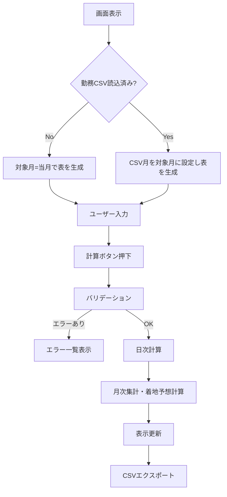
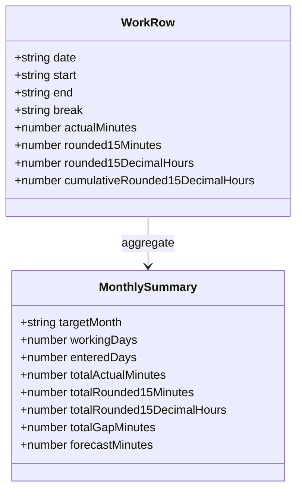

# 稼働時間計算 - 設計書（MVP）

## 1. 前提
- 実装方式: ブラウザ単体（HTML + JavaScript）
- 実行方式: HTMLファイルを直接ブラウザで開く
- 対応ブラウザ: Chrome / Edge
- 保存方式: CSVのみ（LocalStorage不使用）
- 所定労働時間: 1日 `8.0` 時間（固定値）

## 2. 画面設計（1ページ）

### 2.1 画面ブロック
1. 入力ブロック
   - 休日CSV読込ボタン
   - 勤務CSV読込ボタン
   - 計算ボタン
   - CSVエクスポートボタン

2. サマリ表示ブロック
   - 対象月（勤務CSV未読込時は当月）
   - 稼働日数
   - 入力済み日数
   - 総労働時間（実績合計, HH:mm）
   - 総労働時間（15分丸め合計, HH:mm）
   - 総労働時間（15分丸め10進合計）
   - 差分（実績合計 - 15分丸め合計）
   - 今月の着地予想労働時間

3. エラー表示ブロック
   - 画面上部に一覧表示
   - 何日のデータかが分かる文言を含める

4. 勤務入力テーブル
   - 対象月の1日〜末日を全行表示
   - 列: 日付 / 開始 / 終了 / 休憩 / 日次実績 / 日次15分丸め / 日次15分丸め10進 / 累計（15分丸め10進）
   - 休憩の初期値は `01:00`

### 2.2 画面遷移
1ページ完結のため、画面遷移なし。

## 3. データ設計

### 3.1 画面内データ（JSオブジェクト想定）
- HolidayRecord
  - date: string (`YYYY-MM-DD`)
  - name: string

- WorkRow
  - date: string (`YYYY-MM-DD`)
  - start: string (`HH:mm`)
  - end: string (`HH:mm`)
  - break: string (`HH:mm`)
  - actualMinutes: number
  - rounded15Minutes: number
  - rounded15DecimalHours: number
  - cumulativeRounded15DecimalHours: number

- MonthlySummary
  - targetMonth: string (`YYYY-MM`)
  - workingDays: number
  - enteredDays: number
  - totalActualMinutes: number
  - totalRounded15Minutes: number
  - totalRounded15DecimalHours: number
  - totalGapMinutes: number
  - forecastMinutes: number

### 3.2 CSV定義

#### 休日CSV（入力）
- ヘッダ: `date,name`
- 文字コード: UTF-8
- 改行: LF / CRLF
- 同一日付重複: エラー
- 対象月外データ: 無視

#### 勤務CSV（入力/出力）
- ヘッダ: `date,start,end,break,cumulative_work`
- `cumulative_work`: 15分丸め時間の累計（小数時間）
- 文字コード: UTF-8
- 改行: LF / CRLF
- 複数月混在: エラー
- 読込時: 画面データを全置換
- 出力ファイル名: `working-time-YYYY-MM.csv`

## 4. 計算ロジック設計

### 4.1 日次計算
1. `start`, `end`, `break` を分に変換
2. `actualMinutes = (end - start) - break`
3. `rounded15Minutes = actualMinutes` を15分単位で四捨五入
4. `rounded15DecimalHours = rounded15Minutes / 60`

### 4.2 月次集計
1. 日次の `actualMinutes` 合計
2. 日次の `rounded15Minutes` 合計
3. 日次の `rounded15DecimalHours` 合計
4. `gapMinutes = totalActualMinutes - totalRounded15Minutes`
5. `cumulativeRounded15DecimalHours` は日付昇順で累積更新

### 4.3 着地予想
1. `remainingWorkingDays = 稼働日数 - 入力済み日数`
2. `forecastMinutes = totalActualMinutes + (remainingWorkingDays * 8.0 * 60)`
3. 表示時は `HH:mm` に整形

## 5. バリデーション設計
- 日付形式不正: エラー
- 時刻形式不正: エラー
- `end <= start`: エラー
- 休憩が負値相当: エラー
- `actualMinutes < 0`: エラー
- 休日CSVの重複日付: エラー
- 勤務CSVの複数月混在: エラー

エラー表示方針:
- 画面上部に一覧表示
- 各メッセージに対象日付（またはCSV行）を含める

## 6. 処理フロー（疑似）
1. 初期表示
   - 当月を対象月に設定
   - 対象月の全日行を生成

2. 勤務CSV読込
   - パース
   - 単月チェック（複数月ならエラー）
   - 対象月更新
   - 行データを全置換

3. 休日CSV読込
   - パース
   - 重複チェック
   - 対象月外は除外して保持

4. 計算ボタン
   - 入力検証
   - 日次計算
   - 月次集計
   - 着地予想計算
   - 画面更新

5. CSVエクスポート
   - 現在の対象月データからCSVを生成
   - `working-time-YYYY-MM.csv` で保存

## 7. 実装ファイル案（MVP）
- `implementation/src/index.html`
- `implementation/src/style.css`
- `implementation/src/app.js`
- `implementation/src/logic.js`
- `implementation/tests/test.html`（簡易テストページ）
- `implementation/tests/test.js`
- `implementation/tests/logic.test.js`（Jest単体テスト）

## 8. テスト観点（設計レベル）
1. 稼働日数計算
   - 土日と休日CSV除外が正しい

2. 日次/総労働時間
   - 実績と15分丸めの計算一致
   - 差分表示が期待通り

3. 着地予想
   - 固定8.0時間で計算される
   - 入力0日の場合 `0:00` 表示

4. CSV入出力
   - 出力→再読込で値が再現される
   - 複数月混在CSVはエラー
